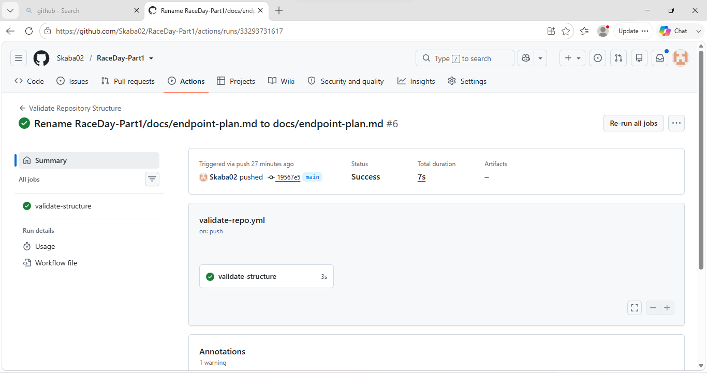

# RaceDay - Part 1: System Planning and Database

## Description

RaceDay is a system for managing running events. An Organiser can create events and set up race categories (for example a 5km or 10km category within one event). A Participant can browse events, enrol in a category, and later view their results once an Organiser has recorded them.

This part of the project covers the planning stage only. No application code is written here. The repository contains the Entity Relationship Diagram, the API endpoint plan, and the SQL script used to build the database in SQL Server Management Studio (SSMS).

## Roles

- **Organiser** - creates and manages events and categories, views who has enrolled, and records results.
- **Participant** - browses events, enrols in a category, and views their own enrolments and results.

## Repository Structure

```
/docs
  ERD.png                - Entity Relationship Diagram
  endpoint-plan.md        - Full API endpoint plan
  database.sql            - SQL script to create and seed the database
.github/workflows
  validate-repo.yml       - GitHub Actions workflow checking the /docs folder
README.md
```

## CI/CD

A GitHub Actions workflow (`.github/workflows/validate-repo.yml`) runs on every push and checks that the `/docs` folder exists and contains the ERD, endpoint plan, and SQL script.

**CI/CD screenshot:**

''
## Video Walkthrough

`[Insert your unlisted YouTube link here]`

The video covers:
- A walkthrough of the ERD and the reasoning behind the entities and relationships.
- The endpoint plan and why each endpoint was included.
- Running the SQL script live in SSMS.

## Notes

The SQL script in `/docs/database.sql` matches the ERD exactly - six entities, with primary keys, foreign keys, and cardinalities as shown in the diagram.
